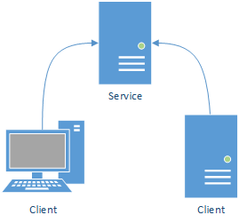
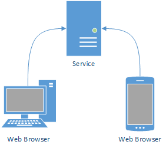

Getting start
===================

  Source of Demos in this documentation can be download on github `Download <https://github.com/aolyn/rpclite.docs/tree/master/samples/HelloRpcLite>`_

When use RpcLite AppHost should be create first configuration is needed, there are two way to provide configuration:

* Configuration file
* Fluent api

Fluent api configuration will be mainly introduced.

.. 
  .. tip::

    后面介绍两种简单的使用方式

Two usage
------------------------
there are two usage of RpcLite

* Create service and client is .Net program

* Create service only client is JavaScript

.. 
  下面的文档会说明在不同平台下如何使用RpcLite。

.. toctree::
  :titlesonly:
  :caption: Plantforms
  :maxdepth: 1

  full-dotnet/index
  netcore/index

